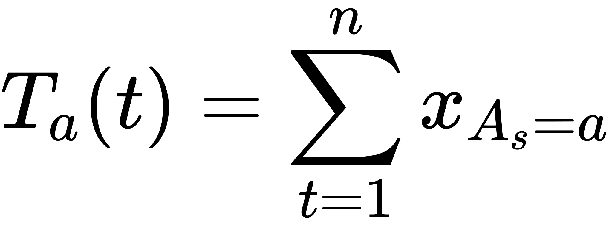
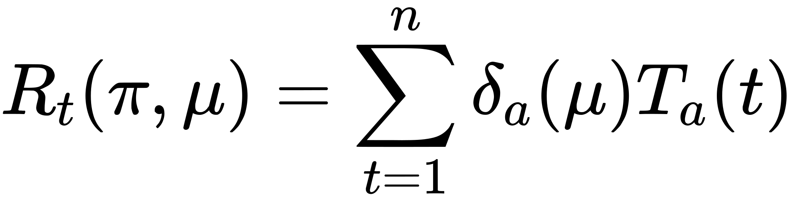

# Bandit Framework Notations,Setting,Types & Regret

# Notations:

A - Action/arm

μ - Joint distribution across arms (unstructured)

π - Policy (Policy which minimizes regret)

ϵ - Environment (Set of possible distributions)

x_t - Reward at time t

y_t - Loss at time t

c_t - Contextual information at time t

# Model

1. Stochastic - Successive rewards from random selection is from same distribution , but independent. Also known as IID. (Intuition - Power pf Random sampling and as time progresses - find the best arm using stochastic efficient models)

2. Adversarial -  Non stochastic/non random. Adversary chooses reward based on the players policy or probability distribution of arms. (Intuition - Adversary chooses reward at each time, as as time progresses , go as close to the best arm in hindsight based on random selection (player doesnt know about the reward for  other arms - key point/power of randomness). 

# Setting:

1. Unstructured - Arms donot share info. μ - joint distribution

Examples : UCB, Explore - exploit etc

2. Structured - Arms leak info. 

Examples: Contextual bandits, Linear bandits, Combinatorial bandits

# Types 
1. Frequentist
2. Bayesian (prior knowledge)

# Feedback
1. Bandit Feedback: Player only gets to see the reward of the arm played
2. Counterfactual/Full feedback : player gets to see the reward of all the arms.

# Regret
<!-- $$
R_t(\pi, \mu) = \mathbb{E}[ \sum_{t=1}^n X_t^* ]- \mathbb{E}[ \sum_{t=1}^n X_t ]$$ --> 

Regret Decomposition:

Suboptimality gap:

 <!-- $$
 \delta_a(\mu) = \mu^*(a) - \mu(a) 
 $$ --> 

Time each arm played
<!-- $$
T_a(t) = \sum_{t=1}^n x_{A_s=a}
$$ --> 

decomposition based on gap and time
<!-- $$
R_t(\pi, \mu) =  \sum_{t=1}^n \delta_a(\mu) T_a(t)
$$ --> 

